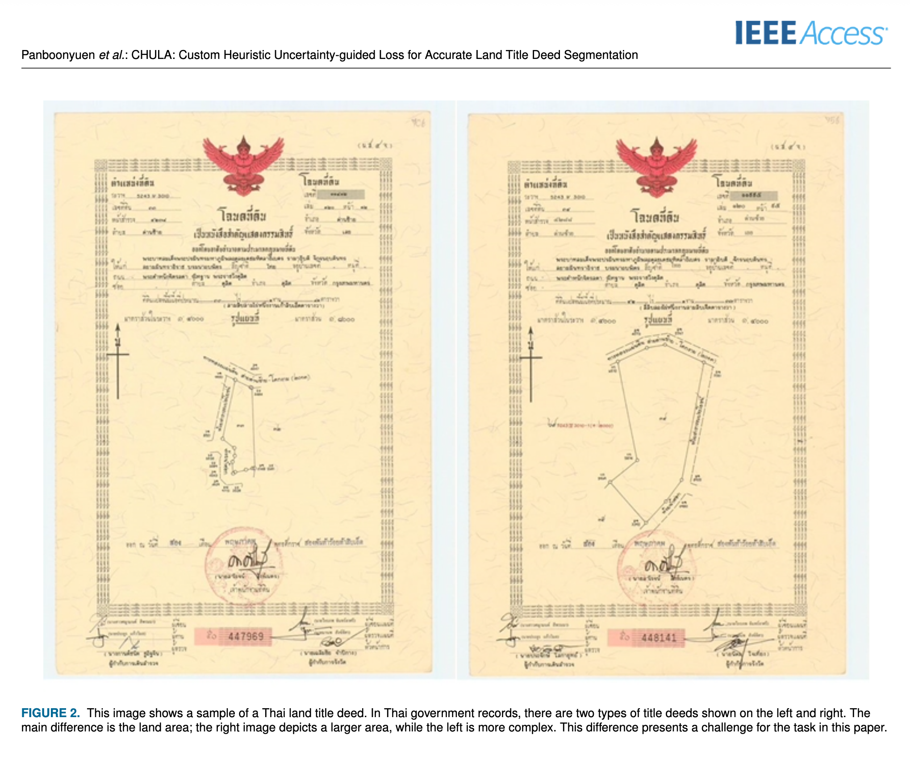
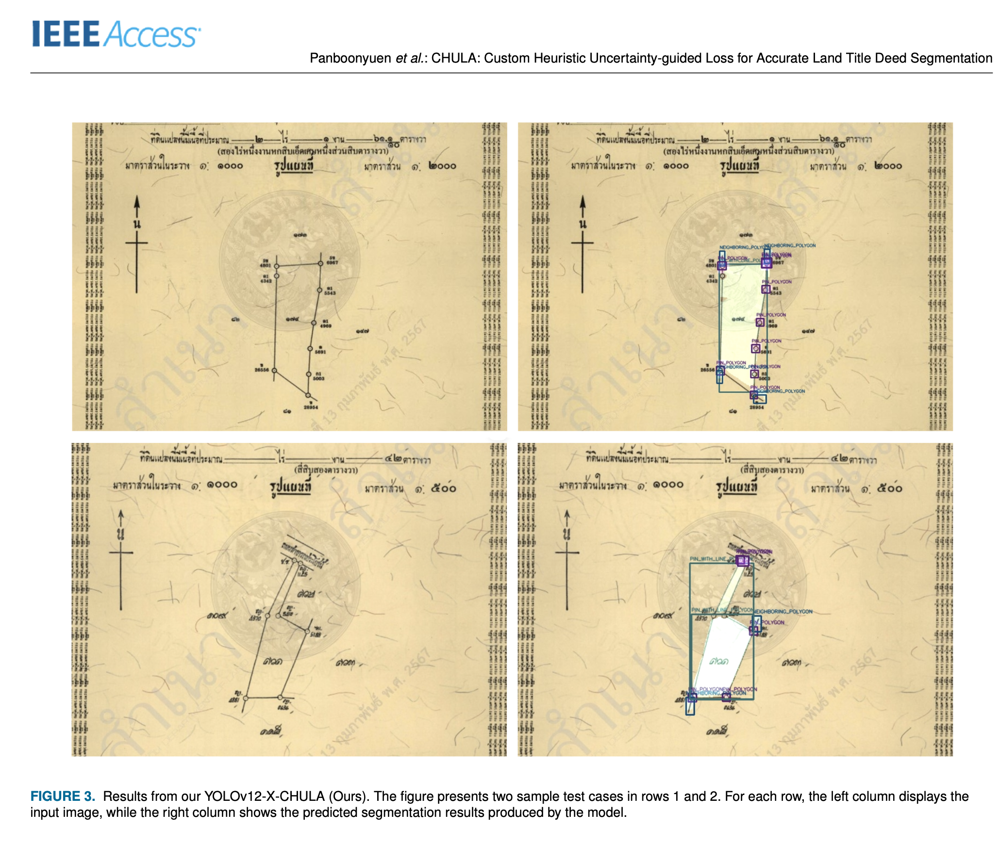
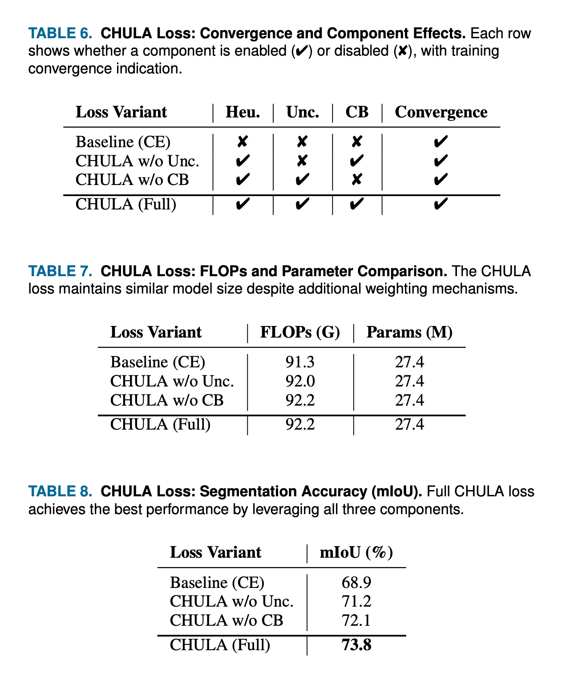

# CHULA: Custom Heuristic Uncertainty-guided Loss for Accurate Land Title Deed Segmentation

### 🧠 Author: Teerapong Panboonyuen  
🚩 Supported by the Second Century Fund (C2F) Postdoctoral Fellowship, Chulalongkorn University  
🧪 Reproducible, Pluggable, and Open Source for Document AI Research

---

## 🌏 Abstract

**CHULA** is a novel **C**ustom **H**euristic **U**ncertainty-guided **L**oss for **A**ccurate segmentation and detection of Thai land title deeds. It combines:

- Class-balanced cross-entropy,
- Aleatoric uncertainty modeling, and
- Domain-specific heuristic priors.

It can be plugged into **any detection/segmentation model** (e.g., YOLOv12, DeepLabv3+) to improve performance on noisy, ambiguous, and structure-rich documents.

> 🚀 Achieved **61.3% mAP (AP₅₀:₉₅)** on a real-world Thai land deed benchmark — significantly better than standard baselines.

---

## 🎯 Key Contributions

- ✅ A unified loss combining uncertainty, class balance, and document heuristics
- ✅ Support for low-resource, underrepresented classes (e.g., PIN, STAMP)
- ✅ Full training & plug-and-play code for YOLO, DeepLab, and more
- ✅ Multi-task learning support (segmentation + detection)

---

## 🖼️ Results & Visuals

### 🔬 Accuracy vs Efficiency Trade-off


### ⏱️ Inference Latency Comparison


---

### 📊 Dataset Sample


### ✅ Sample Output with CHULA


---

### 🔁 Convergence & FLOP Efficiency


### 📈 Overall CHULA Performance


---

## 🛠️ How to Use

### 📦 Setup

```bash
git clone https://github.com/your-username/chula-loss.git
cd chula-loss
pip install -r requirements.txt
````

### 🧪 Train a DeepLabv3+ with CHULA loss

```bash
python train.py --config config.yaml
```

📁 Directory format:

```
data/
├── train/
│   ├── images/
│   └── masks/
├── val/
│   ├── images/
│   └── masks/
```

---

### ⚙️ Integrate CHULA with Your Own Model (YOLO, UNet, etc.)

```python
from chula_loss import CHULALoss

loss_fn = CHULALoss(class_freqs, lambda_ce=1.0, lambda_unc=0.4, lambda_heu=0.6)
loss = loss_fn(pred_logits, targets, uncertainty_map)
```

--