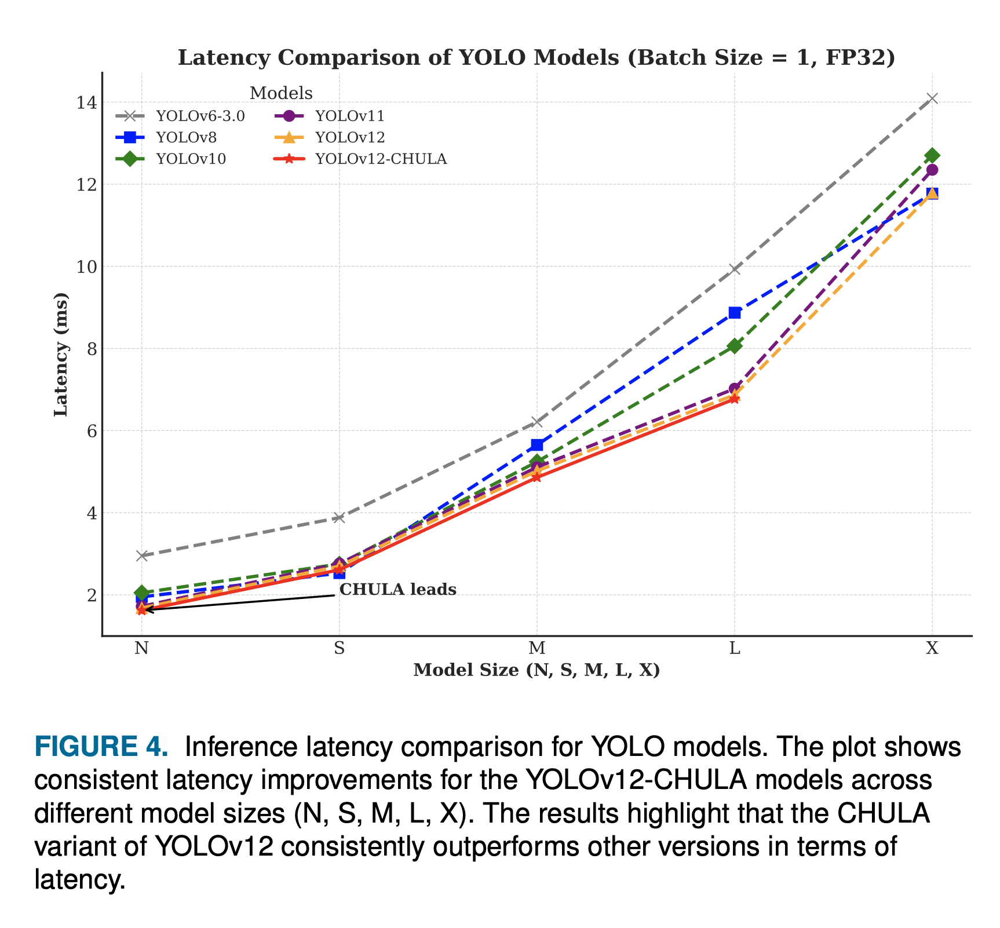
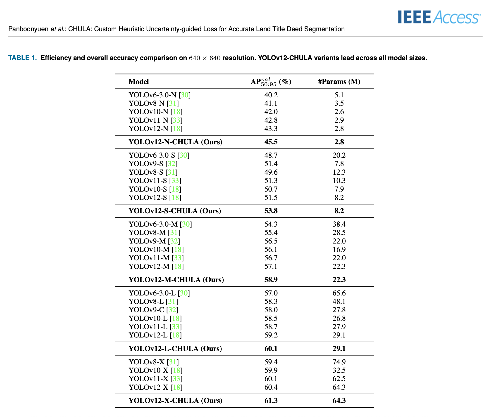

# 🌸 CHULA: Custom Heuristic Uncertainty-guided Loss for Accurate Land Title Deed Segmentation

### 🧠 Author: Teerapong Panboonyuen

🚩 Supported by the Second Century Fund (C2F) Postdoctoral Fellowship, Chulalongkorn University
🧪 Reproducible • Plug-and-Play • Open Source for Document AI Research

---

## 🚀 Try It Now: CHULA in Google Colab

Instantly test CHULA Loss with YOLOv8 on a public medical pills dataset:  
👉 **[Open CHULA Colab Demo](https://colab.research.google.com/github/kaopanboonyuen/CHULA/blob/main/notebook/CHULA_LOSS_withMedicalPillsDetection.ipynb)**

> 📜 _Due to restrictions surrounding access and distribution of Thai Land Title Deed data, this demo uses a public medical dataset to showcase CHULA’s flexibility across domains._

---

## 🌏 Abstract

**CHULA** (Custom Heuristic Uncertainty-guided Loss for Accurate Segmentation & Detection) is a next-generation loss function designed for **noisy, ambiguous, and structure-rich documents** such as **Thai land title deeds**.

It combines:

* ⚖️ **Class-balanced cross-entropy** for handling imbalanced data
* 🌫️ **Aleatoric uncertainty modeling** for robustness against noise
* 📜 **Domain-specific heuristics** tailored for document structures

> 🚀 Achieved **61.3% mAP (AP₅₀:₉₅)** on a real-world Thai land deed benchmark — outperforming standard baselines.

---

## 🎯 Key Contributions

* ✅ Unified loss combining **uncertainty, class balance, and document heuristics**
* ✅ Automatic **class weight computation** & **binary vs multi-class detection**
* ✅ **Optional uncertainty branch** for YOLO without modifying its internals
* ✅ Plug-and-play with **YOLOv8/YOLOv12, DeepLabv3+, UNet**, and more
* ✅ Supports **multi-task learning** (segmentation + detection)

---

## 📂 Repository Structure

```
chula/
├─ chula/                 # Core package
│  ├─ __init__.py
│  ├─ loss.py             # CHULA loss implementation
│  ├─ utils.py            # Class weights, helpers
│
├─ examples/              # Training & evaluation scripts
│  ├─ yolov8_medical_pills.py   # Example: YOLOv8 with CHULA Loss
│
├─ img/                  # Figures for README
│
├─ setup.py              # Packaging script for PyPI
├─ README.md             # Project documentation
├─ LICENSE               # Open-source license
```

📌 The **`examples/`** folder contains reproducible training scripts.

* `yolov8_medical_pills.py` → shows how to apply CHULA Loss to YOLOv8 on a small medical pills dataset
* You can easily adapt to your own dataset & model

---

## 🚀 Quickstart

### 📦 Install

Clone and install:

```bash
git clone https://github.com/kaopanboonyuen/CHULA.git
cd CHULA
pip install -e .
```

Or (coming soon) directly from PyPI:

```bash
pip install chula
```

---

### 🧪 Try in Google Colab

Instantly test CHULA loss with YOLOv8 + Medical Pills dataset:
👉 [Open CHULA Colab Notebook](https://colab.research.google.com/github/kaopanboonyuen/CHULA/blob/main/notebook/CHULA_LOSS_withMedicalPillsDetection.ipynb)

---

### ⚙️ Use with YOLOv8

```python
from chula.loss import CHULALoss
from chula.utils import compute_class_weights

# Auto-detect binary vs multi-class & compute weights
class_weights = compute_class_weights("datasets/medical-pills", num_classes=1).cuda()

loss_fn = CHULALoss(class_weights=class_weights, lambda_ce=1.0, lambda_unc=0.3, lambda_heu=0.5)
loss = loss_fn(pred_logits, targets, uncertainty_map)
```

---

### 📂 Dataset Structure (YOLO format)

```
datasets/
├── medical-pills/
│   ├── images/
│   │   ├── train/
│   │   └── val/
│   ├── labels/
│   │   ├── train/
│   │   └── val/
│   └── medical-pills.yaml
```

---

## 🖼️ Accuracy vs Efficiency Trade-off


## ⏱️ Inference Latency Comparison


## 🛰️ Dataset Sample


## ✅ Sample Output with CHULA


## 📈 Overall CHULA Performance


## 🔁 Convergence & FLOP Efficiency


---

## 🧠 Citation

```latex
@article{panboonyuen2025chula,
  title={CHULA: Custom Heuristic Uncertainty-guided Loss for Accurate Land Title Deed Segmentation},
  author={Panboonyuen, Teerapong},
  year={2025}
}
```

---

## 📬 Contact

**Teerapong Panboonyuen**
📧 [teerapong.pa@chula.ac.th](mailto:teerapong.pa@chula.ac.th)
📍 Chulalongkorn University, Bangkok, Thailand

---

## 🎓 Supported by


---

© 2025 Teerapong Panboonyuen

---